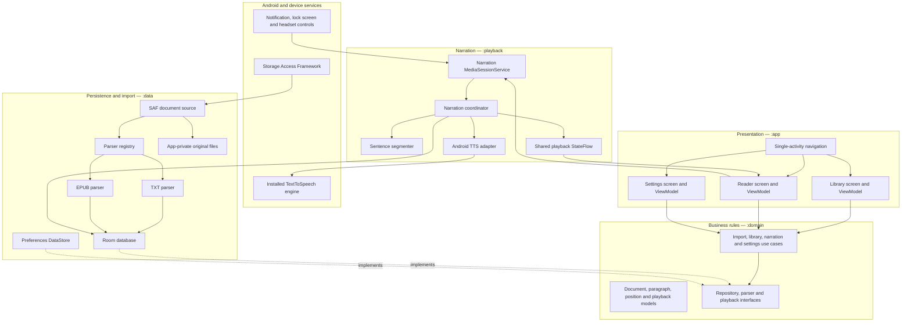

# Orator v1 Architecture and Implementation Specification

Status: Approved implementation blueprint  
Audience: Implementing engineer or coding agent  
Application ID: com.noloxtreme.tts.reader  
Minimum Android version: API 24  
Current UI technology: Kotlin and Jetpack Compose

Implementation tracking note, updated 2026-08-06: checked items below mean the current repository contains the implementation or local verification evidence. Items that require physical-device playback, release verification, generated artwork, or formal acceptance recording remain unchecked until that work is actually done.

This document is the source of truth for Orator v1. Implement the decisions below as written. Do not substitute a cloud speech service, generate permanent audio files, add unsupported document formats, or change the persistence model without recording and approving a new architecture decision.

## 1. Completion rules

- [ ] Complete every required checklist item in Sections 16 through 23.
- [ ] Make every acceptance scenario in Section 22 pass.
- [ ] Keep all book import, parsing, reading, speech, and progress features functional without an internet connection.
- [ ] Record any unavoidable deviation in a new file under docs/adr/ before implementing the deviation.
- [ ] Do not mark a phase complete while any of its exit criteria fail.

Definitions:

- **Document**: One imported novel.
- **Original copy**: The byte-for-byte copy placed in app-private storage during import.
- **Normalized paragraph**: Plain text extracted from a document and stored in Room with stable positions.
- **Document position**: A paragraph index, character offset within that paragraph, and absolute character offset.
- **Safe resume position**: The position from which playback may restart without skipping unheard text.
- **Active range**: The portion of the current paragraph reported as being spoken.
- **Session**: One in-memory narration run identified by a unique session ID.

## 2. Fixed v1 scope

### 2.1 Required

- [x] Import plain-text files through Android's system document picker.
- [x] Import non-DRM EPUB 2 and EPUB 3 files through Android's system document picker.
- [x] Copy every successfully selected source into app-private storage.
- [x] Display all imported books in a local Library screen.
- [x] Display normalized book text in a Reader screen.
- [x] Speak the text through the device's installed Android TextToSpeech engine.
- [ ] Continue narration while the screen is off.
- [x] Provide play, pause, previous-sentence, and next-sentence system media controls.
- [x] Highlight the spoken word or range on API 26 and newer when the installed engine supplies timing ranges.
- [x] Highlight the active sentence/segment on API 24 and 25, and on any newer engine that omits timing ranges.
- [ ] Persist progress between screen changes, process death, force-stop, normal shutdown, and device reboot.
- [x] Restore the saved location after restart, but require the user to press Play.
- [ ] Provide voice, speed, pitch, reader font size, line spacing, and light/dark/system appearance settings.
- [ ] Work offline after a compatible system TTS voice has been installed.

### 2.2 Explicitly out of scope

Do not implement these in v1:

- PDF, DOCX, HTML, RTF, MOBI, Kindle, audiobook, or image imports.
- OCR for scanned pages.
- DRM removal or encrypted EPUB reading.
- Cloud TTS or network-based voices.
- MP3, WAV, or other permanent audio generation.
- Accounts, cloud sync, cross-device progress, or remote storage.
- Bookmarks, notes, annotations, search, translation, or dictionary lookup.
- Embedded EPUB audio, video, scripts, or interactive content.
- Automatic playback after boot.
- A separate custom SplashActivity.
- Embedded EPUB cover extraction. Use the generated title placeholder described in Section 13.
- Sleep timer and Android Auto support.

## 3. Locked architecture decisions

1. Use Clean Architecture with dependency inversion and unidirectional UI state.
2. Use five Gradle modules: :app, :domain, :data, :playback, and :designsystem.
3. Use Hilt for dependency injection.
4. Use Room as the source of truth for document metadata, normalized paragraphs, sections, and progress.
5. Use Preferences DataStore for user settings.
6. Store the original imported file below filesDir/documents/{documentId}/source.{extension}.
7. Do not rely on the source URI after the app-private copy completes.
8. Use Android's Storage Access Framework. Never request broad storage access.
9. Use Android TextToSpeech for live narration.
10. Use a Media3 MediaSessionService and a TTS-backed custom Player adapter for background and system media controls.
11. Represent reading progress using normalized text positions, never elapsed audio milliseconds.
12. Commit a safe resume position after every completed speech segment.
13. Use sentence-aware speech segments. Never submit an entire chapter or book as one TTS utterance.
14. Keep playback service, Room, and UI in the same Android process.
15. Use AndroidX Navigation Compose with one activity.
16. Use Paging 3 for loading paragraphs into the Reader.
17. Use the AndroidX SplashScreen API. Do not delay the splash artificially.
18. Do not add the INTERNET permission.
19. Do not request POST_NOTIFICATIONS in v1; the only notification is attached to an active media session and is permission-exempt.

## 4. System architecture

### 4.1 Source-of-truth rules

| State | Source of truth | Consumers |
|---|---|---|
| Imported book list | Room | Library, playback |
| Normalized paragraphs and sections | Room | Reader, playback |
| Original imported bytes | App-private files | Reparse/recovery tooling |
| Durable reading position | Room ReadingProgress | Reader, playback |
| Active playback state and highlight | PlaybackStateStore in :playback | Reader, media session |
| User settings | Preferences DataStore | Reader, playback, theme |
| Original picker URI | Metadata only | No runtime dependency after import |

The UI must never maintain a second authoritative playback cursor. ViewModels map source state into immutable UI state only.

## 5. Gradle modules and dependency rules

### 5.1 :domain

Type: Kotlin/JVM library.

Contains:

- Domain models and value objects.
- Repository and gateway interfaces.
- Use cases.
- Pure segment-boundary and position policies where they do not require Android APIs.
- Domain errors.

Allowed dependencies:

- Kotlin standard library.
- Kotlin coroutines and Flow.
- AndroidX Paging Common. This library supplies PagingData but no Android SDK types.

Must not depend on:

- Android SDK.
- Compose.
- Room.
- Hilt annotations tied to Android.
- Media3.
- TextToSpeech.

Namespace/package root: com.noloxtreme.tts.reader.domain

### 5.2 :data

Type: Android library.

Contains:

- Room database, entities, DAOs, migrations, and repository implementations.
- Preferences DataStore implementation.
- SAF source adapter and app-private file manager.
- SHA-256 calculation.
- TXT and EPUB parsers.
- Import transaction coordinator.

Allowed project dependency: :domain. Forbidden project dependencies: :app, :playback, and :designsystem.

Namespace/package root: com.noloxtreme.tts.reader.data

### 5.3 :playback

Type: Android library.

Contains:

- NarrationService.
- Media3 MediaSession and custom TTS-backed Player.
- NarrationCoordinator.
- AndroidTtsEngine.
- SentenceSegmenter.
- PlaybackStateStore.
- Audio focus, noisy-route, wake-lock, and notification handling.

Allowed project dependency: :domain. Forbidden project dependencies: :app, :data, and :designsystem. All persistence access must use :domain interfaces supplied by Hilt.

Namespace/package root: com.noloxtreme.tts.reader.playback

### 5.4 :designsystem

Type: Android Compose library.

Contains:

- Color, typography, spacing, shape, and motion tokens.
- OratorTheme.
- Reusable player controls, book placeholder, loading, empty, and error components.
- Shared icons owned by the application.

Must not depend on :domain, :data, :playback, or :app.

Namespace/package root: com.noloxtreme.tts.reader.designsystem

### 5.5 :app

Type: Android application.

Contains:

- MainActivity and application class.
- Hilt composition root and bindings.
- Navigation graph.
- Feature packages: library, reader, settings.
- Compose screens, ViewModels, UI state, and Android file-picker launcher.

Required project dependencies: :domain, :data, :playback, and :designsystem. No lower module may depend on :app.

Package root: com.noloxtreme.tts.reader

### 5.6 Dependency policy

- [x] Declare every dependency and version alias in gradle/libs.versions.toml.
- [x] Use stable library releases compatible with the repository's AGP, Kotlin, compile SDK, and Compose BOM.
- [x] Do not use alpha, beta, RC, snapshot, or dynamic dependency versions.
- [ ] Add Navigation Compose, Hilt, KSP, Room KTX, DataStore Preferences, Paging Common to :domain, Paging Runtime to :data, Paging Compose to :app, Media3 Session/Common, AndroidX SplashScreen, Coroutines Test, and Turbine.
- [x] Add jsoup for EPUB XHTML extraction.
- [x] Keep the existing minimum SDK at 24.
- [x] Do not lower the compile or target SDK.

## 6. Domain model and contracts

Use one public Kotlin type per file, with the file name matching the type name. The public behavior and field semantics must match this section.

### 6.1 Required value objects

    @JvmInline
    value class DocumentId(val value: String)

    data class DocumentPosition(
        val paragraphIndex: Int,
        val offsetInParagraph: Int,
        val absoluteOffset: Long
    )

    data class SpokenRange(
        val paragraphIndex: Int,
        val startInParagraph: Int,
        val endExclusiveInParagraph: Int
    )

Invariants:

- paragraphIndex is zero-based and non-negative.
- offsetInParagraph is between zero and the paragraph length, inclusive.
- absoluteOffset is zero-based and non-negative.
- SpokenRange endExclusiveInParagraph is greater than startInParagraph.
- All offsets refer to normalized text stored in Room, not the source file.
- “Character” and every offset/count in this specification mean a UTF-16 code-unit index in a Kotlin/Java String. Compute lengths in Kotlin, never with SQLite length().
- A generated split boundary must never fall between the high and low surrogate of one Unicode code point.

### 6.2 Document model

Required fields:

- id: DocumentId
- title: String
- originalFileName: String
- mimeType: String
- sha256: String
- detectedLanguageTag: String?
- totalCharacterCount: Long
- sectionCount: Int
- importedAtEpochMillis: Long
- lastOpenedAtEpochMillis: Long?

### 6.2.1 Section, paragraph, progress, and import models

    data class Section(
        val documentId: DocumentId,
        val sectionIndex: Int,
        val title: String?,
        val firstParagraphIndex: Int,
        val lastParagraphIndex: Int,
        val absoluteStart: Long,
        val absoluteEnd: Long
    )

    data class Paragraph(
        val documentId: DocumentId,
        val paragraphIndex: Int,
        val sectionIndex: Int,
        val text: String,
        val absoluteStart: Long,
        val absoluteEnd: Long
    )

    data class ReadingProgress(
        val documentId: DocumentId,
        val position: DocumentPosition,
        val updatedAtEpochMillis: Long,
        val completed: Boolean
    )

    data class ImportSource(
        val opaqueHandle: String,
        val displayName: String,
        val mimeType: String,
        val reportedSizeBytes: Long?
    )

opaqueHandle contains the selected content URI serialized as a string. Only :data may convert it back to android.net.Uri. Do not persist opaqueHandle after import completes or fails.

Implement ImportState as a sealed type with the states in Section 8.6.

    enum class ThemePreference { SYSTEM, LIGHT, DARK }

    enum class LineHeightPreference {
        COMPACT,
        COMFORTABLE,
        SPACIOUS
    }

    data class OratorSettings(
        val voiceName: String?,
        val speechRate: Float,
        val speechPitch: Float,
        val readerFontSizeSp: Int,
        val lineHeight: LineHeightPreference,
        val followSpokenText: Boolean,
        val theme: ThemePreference
    )

DataStore defaults:

- voiceName: null, meaning resolve an offline voice using Section 9.3.
- speechRate: 1.0.
- speechPitch: 1.0.
- readerFontSizeSp: 20.
- lineHeight: COMFORTABLE.
- followSpokenText: true.
- theme: SYSTEM.

Use one Preferences DataStore named orator_settings with these exact keys:

| Key | Type |
|---|---|
| voice_name | String; absent means null |
| speech_rate | Float |
| speech_pitch | Float |
| reader_font_size_sp | Int |
| line_height | String enum name |
| follow_spoken_text | Boolean |
| theme | String enum name |

Unknown enum strings use the documented default and are replaced with the default on the next settings write.

Clamp corrupt or out-of-range stored values to the limits in Section 11.4 before exposing them.

### 6.3 Playback model

Implement a sealed playback state with these variants:

- Idle
- Preparing(documentId, requestedPosition)
- Playing(documentId, safePosition, activeRange)
- Paused(documentId, resumePosition, activeRange?)
- Completed(documentId)
- Error(documentId?, errorCode, recoverable)

Playback commands:

- load(documentId)
- play()
- pause(userInitiated: Boolean)
- skipToPreviousSentence()
- skipToNextSentence()
- seekTo(position)
- stop()
- applySpeechSettings(settings)

Do not expose TextToSpeech, Media3 Player, Room entities, or Android Uri through these contracts.

### 6.4 Required interfaces

    interface DocumentRepository {
        fun observeLibrary(): Flow<List<Document>>
        fun observeDocument(id: DocumentId): Flow<Document?>
        suspend fun getDocument(id: DocumentId): Document?
        suspend fun updateLastOpened(id: DocumentId, epochMillis: Long)
        suspend fun deleteDocument(id: DocumentId)
    }

deleteDocument owns the tombstone, Room deletion, rollback, and startup-cleanup behavior in Section 11.2. Its successful return means the Room record is gone and the private directory is either deleted or safely named .delete-{documentId} for startup cleanup.

    interface DocumentImporter {
        fun import(source: ImportSource): Flow<ImportState>
        suspend fun cancelActiveImport()
    }

    interface ContentRepository {
        fun pagedParagraphs(
            id: DocumentId,
            initialParagraphIndex: Int
        ): Flow<PagingData<Paragraph>>
        suspend fun paragraph(id: DocumentId, index: Int): Paragraph?
        suspend fun paragraphContaining(id: DocumentId, absoluteOffset: Long): Paragraph?
        suspend fun section(id: DocumentId, index: Int): Section?
        suspend fun sentenceBefore(id: DocumentId, position: DocumentPosition): DocumentPosition
        suspend fun sentenceAfter(id: DocumentId, position: DocumentPosition): DocumentPosition
    }

    interface ProgressRepository {
        fun observeProgress(id: DocumentId): Flow<ReadingProgress?>
        suspend fun getProgress(id: DocumentId): ReadingProgress?
        suspend fun saveProgress(progress: ReadingProgress)
        suspend fun deleteProgress(id: DocumentId)
    }

    interface SettingsRepository {
        fun observeSettings(): Flow<OratorSettings>
        suspend fun updateSettings(transform: (OratorSettings) -> OratorSettings)
    }

    interface TimeProvider {
        fun nowEpochMillis(): Long
    }

    interface NarrationController {
        val state: StateFlow<NarrationState>
        suspend fun load(documentId: DocumentId)
        fun play()
        fun pause()
        fun previousSentence()
        fun nextSentence()
        fun seekTo(position: DocumentPosition)
        fun stop()
    }

Use AndroidX Paging Common's PagingData exactly as shown. The :domain module remains a JVM module and receives no Android SDK types. :data supplies PagingData; :app consumes it through Paging Compose.

### 6.5 Required use cases

- ObserveLibrary
- ImportDocument
- OpenDocument
- DeleteDocument
- ObserveReaderContent
- ObserveReadingProgress
- StartOrResumeNarration
- PauseNarration
- SeekNarration
- SkipSentence
- RestartCompletedDocument
- ObserveSettings
- UpdateSpeechSettings
- UpdateReaderSettings

Each use case must have one public operation and depend only on narrow domain interfaces.

## 7. Room data model

Database filename: orator.db

Use foreign keys, enable foreign-key enforcement, and delete child records with ON DELETE CASCADE.

### 7.1 documents

| Column | Type | Constraints |
|---|---|---|
| id | TEXT | Primary key; UUID string |
| title | TEXT | Not null; trimmed; not blank |
| original_file_name | TEXT | Not null |
| mime_type | TEXT | Not null |
| source_extension | TEXT | Not null |
| private_source_path | TEXT | Not null; relative to filesDir |
| sha256 | TEXT | Not null; unique |
| language_tag | TEXT | Nullable BCP-47 tag |
| total_character_count | INTEGER | Not null; committed value at least 1 |
| section_count | INTEGER | Not null; committed value at least 1 |
| imported_at | INTEGER | Epoch milliseconds |
| last_opened_at | INTEGER | Nullable epoch milliseconds |

Create a unique index on sha256 and an index on last_opened_at.

### 7.2 sections

| Column | Type | Constraints |
|---|---|---|
| document_id | TEXT | Foreign key to documents.id |
| section_index | INTEGER | Zero-based |
| title | TEXT | Nullable |
| first_paragraph_index | INTEGER | Inclusive |
| last_paragraph_index | INTEGER | Inclusive |
| absolute_start | INTEGER | Inclusive |
| absolute_end | INTEGER | Exclusive |

Primary key: document_id plus section_index.

### 7.3 paragraphs

| Column | Type | Constraints |
|---|---|---|
| document_id | TEXT | Foreign key to documents.id |
| paragraph_index | INTEGER | Zero-based and document-wide |
| section_index | INTEGER | Zero-based |
| text | TEXT | Not null and not blank |
| absolute_start | INTEGER | Inclusive |
| absolute_end | INTEGER | Exclusive |

Primary key: document_id plus paragraph_index.

Indexes:

- document_id plus section_index plus paragraph_index
- document_id plus absolute_start plus absolute_end

Absolute positions are computed as if each stored paragraph were joined to the next paragraph with exactly two newline characters. For a paragraph with text length N:

- absolute_end = absolute_start + N
- the next paragraph's absolute_start = absolute_end + 2
- total_character_count = the final paragraph's absolute_end

No separator is added after the final paragraph.

Do not add SQL CHECK constraints requiring positive total_character_count or section_count because the importer inserts zero-valued provisional fields inside its uncommitted transaction. The repository must update both fields to positive values and validate them before commit; zero values must never be externally observable.

### 7.4 reading_progress

| Column | Type | Constraints |
|---|---|---|
| document_id | TEXT | Primary key and foreign key |
| paragraph_index | INTEGER | Zero-based |
| offset_in_paragraph | INTEGER | Inclusive cursor |
| absolute_offset | INTEGER | Same logical position |
| updated_at | INTEGER | Epoch milliseconds |
| completed | INTEGER | Boolean |

When completed is true, the position must equal the end of the final paragraph.

### 7.5 Database rules

- [x] Insert a document, its sections, paragraphs, and initial progress in one Room transaction.
- [x] Insert paragraphs in bounded batches; never build one SQL statement containing the whole book.
- [ ] Verify progress positions against the referenced paragraph before saving.
- [x] Expose Room entities only inside :data; map them to domain models.
- [x] Set exportSchema to true and commit every Room schema JSON under data/schemas.
- [ ] Add a migration test for every future schema change.
- [x] Exclude orator.db, its journal files, and imported document files from Android cloud backup.

## 8. File selection and import pipeline

### 8.1 Picker

Use ActivityResultContracts.OpenDocument. Provide these MIME types:

- text/plain
- application/epub+zip

Do not use ACTION_GET_CONTENT, MANAGE_EXTERNAL_STORAGE, READ_EXTERNAL_STORAGE, or READ_MEDIA_*.

Format resolution:

- Treat MIME application/epub+zip or filename extension .epub as an EPUB claim. Require a valid ZIP header and the EPUB mimetype entry.
- Treat MIME text/plain or filename extension .txt as a TXT claim. Require successful decoding under Section 8.4.
- Accept application/octet-stream only when .txt or .epub identifies the format and the corresponding validation succeeds.
- If MIME and extension claim different supported formats, return UNSUPPORTED_FORMAT.
- Ignore filename case when checking extensions.

The app must copy the source immediately. Keep the URI only inside the in-memory ImportSource during import, close its stream on every outcome, and discard the URI when import completes or fails. Do not call takePersistableUriPermission and do not store the URI in Room or DataStore.

### 8.2 Limits

- Maximum source file size: 100 MiB.
- Maximum EPUB ZIP entry count: 10,000.
- Maximum total uncompressed EPUB content: 250 MiB.
- Maximum single EPUB ZIP entry: 25 MiB.
- Reject ZIP entries whose normalized destination escapes the import workspace.
- Reject EPUB files containing encrypted reading-order content or DRM declarations.
- Reject a parsed document containing no non-whitespace paragraph text.

Use 1 MiB = 1,048,576 bytes.

### 8.3 Atomic import algorithm

1. Create a UUID document ID.
2. Create filesDir/documents/.import-{documentId}.
3. Stream the selected source into source.bin inside the temporary directory while:
   - enforcing the 100 MiB limit;
   - calculating SHA-256;
   - reporting byte progress when the provider exposes a length.
4. Query Room for the SHA-256.
5. If a ready document with that hash exists:
   - delete the temporary directory;
   - return ExistingDocument(existingId);
   - navigate to the existing document instead of creating a duplicate.
6. Select the parser by verified MIME type and file signature/extension. If MIME and content/extension evidence conflict, reject the source as UNSUPPORTED_FORMAT rather than guessing.
7. Rename source.bin to source.txt for TXT or source.epub for EPUB, then rename the temporary directory to filesDir/documents/{documentId} using File.renameTo on the same filesystem. Treat either false return as an import failure.
8. Read parser metadata from the finalized source and prepare a lazy paragraph sequence. Do not collect the sequence into one in-memory list.
9. Begin one Room transaction and insert a provisional document row that remains invisible outside the uncommitted transaction.
10. Consume the parser's sequence once inside that transaction. Normalize and insert paragraphs in batches of 250 while computing section bounds, paragraph indexes, and absolute offsets.
11. Insert each completed section, update the document row with final title/language/count values, and insert initial progress at paragraph zero, offset zero, absolute offset zero.
12. Validate that at least one paragraph exists and that every stored position satisfies Section 7, then commit.
13. If parsing, validation, or database insertion fails, roll back Room, delete the finalized private directory, and return the mapped import error.
14. Before enabling imports on each fresh application-process startup:
    - delete every .import-* directory;
    - delete .delete-* directories immediately;
    - delete UUID-named document directories that have no matching Room document row.

Never delete the user's original source.

### 8.4 TXT parser

Support:

- UTF-8, with or without a UTF-8 BOM.
- UTF-16 little-endian or big-endian only when a BOM is present.
- LF and CRLF line endings.

Reject malformed input that cannot be decoded using these rules. Do not silently fall back to a device-dependent charset.

Normalization:

- Convert CRLF and CR to LF.
- Normalize Unicode to NFC.
- Split paragraphs on one or more blank lines.
- Trim leading/trailing whitespace from each paragraph.
- Convert runs of intra-paragraph whitespace to one ordinary space.
- Drop blank paragraphs.
- Create one section titled with the filename without its extension.

### 8.5 EPUB parser

Implement EPUB parsing with java.util.zip.ZipFile, namespace-aware XML parsing, and jsoup for XHTML-to-text extraction.

Disable DTD processing and external entity resolution in every XML/HTML parser. Resolve EPUB-relative resource paths only inside the ZIP namespace.

Algorithm:

1. Confirm the mimetype entry identifies application/epub+zip.
2. Read META-INF/container.xml and locate the package OPF.
3. Reject encrypted reading-order resources declared in META-INF/encryption.xml.
4. Parse package metadata, manifest, and spine.
5. Visit XHTML/HTML resources strictly in OPF spine order.
6. Ignore scripts, styles, forms, images, audio, video, SVG-only content, and hidden navigation content.
7. Extract headings and block elements: h1-h6, p, li, blockquote, and pre.
8. Treat br as a line boundary.
9. Decode entities, normalize Unicode to NFC, collapse whitespace, and discard blank output.
10. Start a section at each spine item. Set its title to the first non-blank heading; if absent, use its non-blank navigation label; if both are absent, set title to null.
11. Use Dublin Core title metadata as the document title when non-blank; otherwise use the filename without extension.
12. Use Dublin Core language as the BCP-47 language candidate when valid.
13. Reject books whose spine yields no readable paragraphs.

Do not execute or preserve EPUB scripts.

### 8.6 Import UI states

Implement exactly these states:

- NoImport
- AwaitingPicker
- Copying(bytesCopied, totalBytes?)
- Parsing
- Saving
- Success(documentId)
- ExistingDocument(documentId)
- Failure(errorCode)

Disable the Add book control while the same ViewModel owns an active import. Cancellation must close all streams, remove the temporary directory, and leave Room unchanged.

### 8.7 Common metadata normalization

- Replace ISO control characters in titles and filenames with ordinary spaces.
- Collapse whitespace, trim the result, and limit each stored title/filename to 200 UTF-16 code units without splitting a surrogate pair.
- Use “Untitled book” if the resolved title becomes blank.
- Store canonical MIME text/plain for TXT and application/epub+zip for EPUB, regardless of a provider's generic MIME.
- Accept a language tag only when Locale.forLanguageTag produces a non-blank language. Store the normalized Locale.toLanguageTag result; otherwise store null.
- Set importedAt from an injected TimeProvider at the successful transaction commit.
- Set lastOpenedAt to null on import and update it when Reader successfully reaches Ready.

## 9. Narration architecture

### 9.1 Service

Create NarrationService as a Media3 MediaSessionService in :playback.

Manifest requirements:

- android.permission.FOREGROUND_SERVICE
- android.permission.FOREGROUND_SERVICE_MEDIA_PLAYBACK
- android.permission.WAKE_LOCK
- foregroundServiceType="mediaPlayback"
- exported="false"
- stopWithTask="false"
- An intent filter action for androidx.media3.session.MediaSessionService
- A queries intent for android.intent.action.TTS_SERVICE
- No INTERNET permission
- No POST_NOTIFICATIONS permission

Start foreground narration only in response to a visible user action. Do not register a boot receiver.

The service must own:

- The MediaSession.
- The TTS-backed Player adapter.
- NarrationCoordinator.
- AndroidTtsEngine.
- Audio-focus state.
- A non-reference-counted partial wake lock held only while Playing.
- Registration for AUDIO_BECOMING_NOISY only while playback is active.

At each segment start, release any held Orator wake lock and reacquire it with a 10-minute timeout. Release it immediately on segment completion before the next segment reacquires it, and on every transition out of Playing.

### 9.2 Media behavior

Implement TtsPlayerAdapter by extending Media3 SimpleBasePlayer on the main Looper and opting in to Media3's UnstableApi.

Its Player state must:

- contain exactly one MediaItem for the loaded document;
- report duration and time-based position as C.TIME_UNSET/zero rather than inventing audio duration;
- advertise Play, Pause, Stop, SeekToPreviousMediaItem, and SeekToNextMediaItem;
- not advertise seek-in-current-item, arbitrary playlist editing, shuffle, or repeat;
- map handlers to NarrationCoordinator and call invalidateState after coordinator state changes;
- release coordinator/TTS resources when Player.release is called.

NarrationService must create the Player and MediaSession in onCreate, return the session from onGetSession, and release both in onDestroy.

Expose these system commands:

- Play
- Pause
- Previous media item mapped to previous sentence
- Next media item mapped to next sentence
- Stop

Do not expose a time-based seek bar because TTS duration is not known reliably. The in-app reader must display character-percentage progress as floor(absoluteOffset * 100 / totalCharacterCount), clamped to 0 through 100.

Media metadata:

- Title: document title.
- Artist/subtitle: current section title or “Document”.
- Artwork: generated title placeholder rendered to a bitmap.

Notification:

- Ongoing only while Preparing or Playing.
- Dismissible while Paused; dismissal stops the session but retains progress.
- Uses the monochrome Orator notification icon.
- Shows play/pause and previous/next sentence controls.

### 9.3 TTS initialization

Define this Android-free interface inside :playback and implement it with AndroidTtsEngine:

    internal interface SpeechEngine {
        val events: Flow<SpeechEvent>
        suspend fun initialize(configuration: SpeechConfiguration): SpeechInitResult
        fun speak(segment: SpeechSegment): SpeechSubmitResult
        fun stop()
        fun shutdown()
    }

SpeechEvent is a sealed type with Started(utteranceId), RangeStarted(utteranceId, start, end), Completed(utteranceId), Stopped(utteranceId, interrupted), and Failed(utteranceId, errorCode). Serialize all SpeechEvent handling onto one coordinator CoroutineDispatcher; callbacks must never mutate playback state directly from a TTS binder thread.

SpeechConfiguration contains resolved BCP-47 language tag, resolved offline voice name, speechRate, and speechPitch. SpeechSegment contains utteranceId, documentId, paragraphIndex, startInParagraph, endExclusiveInParagraph, and the exact text substring submitted to TTS. SpeechSubmitResult and SpeechInitResult must be typed success/error results rather than booleans.

Only voices whose Voice.isNetworkConnectionRequired value is false are eligible in v1.

1. Use the requested voice when it is installed and offline-capable.
2. Otherwise select the first offline voice whose locale exactly matches the document language tag, sorting candidates by voice name.
3. Otherwise select the first offline voice with the same ISO language, sorting candidates by voice name.
4. Otherwise use the engine default only when it is offline-capable.
5. If no offline voice exists, emit TTS_LANGUAGE_MISSING and present the install/configure action.
6. When a fallback voice is selected, show one non-blocking message naming the selected language.
7. Apply speech rate and pitch before speaking.
8. Use AudioAttributes with USAGE_MEDIA and CONTENT_TYPE_SPEECH.
9. Emit a typed error if the TTS engine cannot initialize or reports missing language data.

Do not download language data automatically. Present an Android intent/action that lets the user install or configure TTS data. The Settings voice picker must list offline-capable voices only.

### 9.4 Segmenting

Use java.text.BreakIterator.getSentenceInstance(resolvedLocale).

For each paragraph:

1. Start at the requested offset within the paragraph.
2. Produce sentence-boundary segments in original normalized paragraph coordinates.
3. Limit submitted text length to min(TextToSpeech.getMaxSpeechInputLength() - 100, 3000).
4. If a sentence exceeds the limit, split at the last whitespace at or before the limit.
5. If no whitespace exists, split exactly at the limit.
6. If the proposed boundary divides a UTF-16 surrogate pair, move it backward by one code unit.
7. Never create an empty segment.
8. Never create a segment spanning two paragraphs.

Each utterance ID must include:

- narration session UUID;
- document ID;
- paragraph index;
- segment start;
- segment end;
- monotonically increasing sequence number.

Ignore callbacks whose session UUID does not match the active session.

### 9.5 Spoken-range mapping

TextToSpeech range callbacks are relative to submitted segment text.

Map a callback as follows:

- startInParagraph = segmentStartInParagraph + callbackStart
- endInParagraph = segmentStartInParagraph + callbackEnd

Validate and clamp both values to the segment and paragraph bounds before emitting SpokenRange. Expand a callback boundary outward by one UTF-16 code unit when needed to avoid highlighting half of a surrogate pair.

Set the active range to the entire submitted segment in onStart on every API level. On API 26+, replace that range from each valid onRangeStart callback. Engines that send no range callbacks therefore retain the segment fallback. API 24 and 25 always retain the segment fallback.

### 9.6 Pause, resume, and safe progress

On segment completion:

- Save the segment end as the safe resume position.
- If it equals the paragraph end, advance the safe position to offset zero of the next paragraph.
- If it is the final paragraph end, mark progress completed and enter Completed.
- Persist before submitting the next segment.

On explicit user pause:

- If an active range exists, save the start of that range.
- Otherwise save the start of the active segment.
- Stop TTS.
- Release audio focus and wake lock.
- Enter Paused.

On unexpected process or device termination, the last committed completed-segment position remains authoritative. Repeating part of one segment is acceptable; skipping text is not.

Changing voice, rate, or pitch while Playing must:

1. Save the current active-range start.
2. Stop the current utterance.
3. Reconfigure TTS.
4. Resume from the saved position.

Previous/next sentence behavior:

- Use the active-range start as the anchor while Playing; otherwise use the durable progress position.
- Previous selects the nearest sentence start strictly before the anchor. If none exists in the paragraph, select the final sentence start in the preceding paragraph. Clamp to document start.
- Next selects the nearest sentence start strictly after the anchor. If none exists in the paragraph, select offset zero in the following paragraph. Clamp to document end.
- Save the selected position before issuing new speech.
- If the prior state was Playing, stop the old session segment and immediately speak from the selected position.
- If the prior state was Paused, update the paused cursor without starting speech.

### 9.7 Audio interruptions

- Use AudioFocusRequest with AUDIOFOCUS_GAIN and setWillPauseWhenDucked(true) on API 26+.
- Use the legacy requestAudioFocus overload with STREAM_MUSIC and AUDIOFOCUS_GAIN on API 24–25.
- Register the noisy-route receiver dynamically with ContextCompat.RECEIVER_NOT_EXPORTED while Preparing or Playing, and unregister it in every other state.
- Permanent audio-focus loss: pause and do not auto-resume.
- Transient audio-focus loss: pause and set resumeOnFocusGain=true.
- Focus gain after a transient loss: resume only when resumeOnFocusGain is true.
- User pause clears resumeOnFocusGain.
- Duck request: pause instead of lowering speech volume.
- Headphones/Bluetooth becoming noisy: pause and do not auto-resume.

## 10. Restore behavior

### 10.1 App restart

On Library startup:

1. Observe documents ordered by lastOpenedAt descending, then importedAt descending.
2. Show the most recently opened unfinished document in Continue reading.
3. Display its title, section title, and character percentage.
4. Opening it loads the saved paragraph and offset.
5. Do not begin speech automatically.

### 10.2 Service recreation

If Android recreates NarrationService while a media session was active:

- Load the most recently active document ID from saved service state only when available.
- Re-read durable progress from Room.
- Rebuild a Paused session.
- Do not speak until the user requests Play.

### 10.3 Reboot and force-stop

- Do not start a service at boot.
- Do not request RECEIVE_BOOT_COMPLETED.
- After a reboot or force-stop, normal app launch restores Library and progress from Room.
- The first Play action creates a new narration session from the safe resume position.

## 11. Navigation and screen specifications

Routes:

- library
- reader/{documentId}
- settings

MainActivity is the only activity.

### 11.1 System splash

- Use AndroidX SplashScreen from MainActivity.
- Use the adaptive Orator launcher foreground over the theme background.
- Provide light and dark splash theme colors.
- Keep the splash until the first DataStore theme value is read. Stop waiting after 1,000 ms, use SYSTEM for that launch, and continue loading settings after the first frame.
- Never add an artificial timer, animation gate, network request, or SplashActivity.

### 11.2 Library screen

States:

- Loading
- Empty
- Content(documents, continueDocument?)
- Importing(importState)
- Error(message, retryAction?)

Required layout:

- Top app bar: Orator title and Settings action.
- Continue reading card at the top when an unfinished last-opened document exists.
- LazyColumn of documents below it.
- Extended “Add book” floating action button in Empty state.
- Standard add floating action button in Content state.
- Generated placeholder for every document; do not leave a blank cover.
- Per-document overflow actions: Open and Delete.

Delete behavior:

1. Show a confirmation dialog containing the document title.
2. If that document is active in NarrationService, issue Stop and wait until NarrationController reports Idle.
3. Rename filesDir/documents/{documentId} to filesDir/documents/.delete-{documentId}. If the source directory is already absent, continue.
4. Delete the Room document transactionally.
5. If the Room transaction fails, rename the tombstone directory back to its original name and report an error.
6. If the Room transaction succeeds, recursively delete the tombstone directory.
7. If final recursive deletion fails, leave the .delete-{documentId} tombstone; startup cleanup removes it before showing Library.

Empty-state copy must explain:

- “Add a TXT or EPUB book.”
- “Books and reading progress stay on this device.”

### 11.3 Reader screen

States:

- Loading
- Ready(document, paragraphs, progress, narrationState, followMode)
- MissingDocument
- Error(message, retryAction?)

Required layout:

- Top app bar with Back, truncated document title, and appearance/settings action.
- Current section title below the app bar when available.
- LazyColumn backed by Paging 3 for paragraphs.
- Body width capped at 720 dp and centered on large screens.
- Persistent bottom playback controls.
- Character-based book percentage.
- Speech speed control available from the player settings sheet.

Playback controls, left to right:

1. Previous sentence.
2. Play or Pause.
3. Next sentence.
4. Speech settings.

When progress is Completed, replace Play with “Start again”. Pressing it atomically resets progress to paragraph zero/offset zero/completed=false, scrolls to the first paragraph, and starts a new narration session.

Text highlighting:

- Active paragraph remains visible while follow mode is enabled.
- Active sentence/segment uses activeSentenceBackground.
- API 26+ active word/range additionally uses activeWordBackground and semibold text.
- Highlight spans are applied only to the visible active paragraph.
- The whole book must never be rebuilt as one AnnotatedString.

Follow mode:

- Defaults to enabled.
- Programmatic movement caused by playback must not disable it.
- A user scroll that moves the active paragraph completely off screen disables it.
- When disabled, show a “Return to narration” floating chip.
- Pressing the chip scrolls to the active paragraph and re-enables follow mode.

Initial positioning:

- Load the page containing saved paragraphIndex.
- Scroll the saved paragraph to the top of the reading viewport with 16 dp top spacing.
- Do not show a spoken-range highlight until playback begins. While paused, show a 3 dp primary-colored leading bar beside the saved paragraph.

Accessibility:

- Each paragraph is one readable semantics node.
- Do not announce every highlight change through TalkBack.
- Controls expose explicit labels: “Previous sentence”, “Play”, “Pause”, “Next sentence”, and “Speech settings”.

### 11.4 Settings screen

Sections:

1. Speech
   - Voice picker grouped by language.
   - Rate slider from 0.5x to 2.0x, step 0.1x, default 1.0x.
   - Pitch slider from 0.5x to 1.5x, step 0.1x, default 1.0x.
   - “Preview voice” action using a fixed localized sample sentence.
2. Reading
   - Font size slider from 16 sp to 32 sp, step 1 sp, default 20 sp.
   - Line height selection: Compact 1.35, Comfortable 1.55, Spacious 1.75; default Comfortable.
   - Follow spoken text toggle; default on.
3. Appearance
   - System, Light, Dark; default System.
4. About
   - Supported formats.
   - Offline/privacy statement.
   - App version.

Persist settings immediately. Voice/rate/pitch changes follow the restart behavior in Section 9.6.

## 12. UI state and event rules

- ViewModels expose StateFlow of immutable screen state.
- Screens send typed user intents to ViewModels.
- One-time effects such as opening the picker or displaying a snackbar use a buffered effect stream and are not stored as durable screen state.
- Do not pass repositories directly to composables.
- Do not launch navigation directly from repositories or services.
- Collect Flow with lifecycle awareness.
- Save only lightweight UI choices in SavedStateHandle; never save book text.
- All disk, parser, hashing, and TTS initialization work must run off the main thread.

## 13. Visual design and required assets

### 13.1 Visual direction

Brand concept: an open book whose center gutter becomes a speech waveform. It must remain recognizable as a single-color 24 dp icon.

Light palette:

| Token | Value |
|---|---|
| background | #FBF7EF |
| surface | #FFFFFF |
| primary | #285E61 |
| onPrimary | #FFFFFF |
| primaryText | #202427 |
| secondaryText | #586064 |
| activeSentenceBackground | #DCEDEA |
| activeWordBackground | #F4C95D |
| error | #BA1A1A |

Dark palette:

| Token | Value |
|---|---|
| background | #111719 |
| surface | #192124 |
| primary | #79C4C2 |
| onPrimary | #073738 |
| primaryText | #E9ECE8 |
| secondaryText | #B7C0C1 |
| activeSentenceBackground | #234142 |
| activeWordBackground | #D9AA38 |
| error | #FFB4AB |

Use the platform serif family for reader text and the platform sans-serif family for application controls. Do not bundle an externally licensed font in v1.

Default reader metrics:

- Body size: 20 sp.
- Line height: 31 sp.
- Paragraph bottom spacing: 12 dp.
- Horizontal phone padding: 20 dp.
- Maximum content width: 720 dp.
- Minimum interactive target: 48 by 48 dp.

Disable dynamic color in v1 so highlight contrast is predictable.

Generated title placeholder:

- Use a 2:3 rounded rectangle with 12 dp corners.
- Select its background from #285E61, #6B4F7A, #8A5A44, #526D3F, #365B7D, and #7A4A58 using the unsigned first SHA-256 byte modulo six.
- Render at most two uppercase initials in white platform serif semibold.
- Use the first Unicode letter/digit from each of the first two title words. For a one-word title, use its first two Unicode letters/digits. If no such character exists, use “O”.
- Add the full book title as the accessibility content description; do not expose the initials as a separate semantics node.

### 13.2 Asset checklist

- [ ] Create artwork/orator-logo-master.svg as the editable master.
- [ ] Create app/src/main/res/drawable/ic_launcher_foreground.xml with the book/wave symbol.
- [ ] Create app/src/main/res/drawable/ic_launcher_background.xml using light primary #285E61.
- [ ] Create app/src/main/res/drawable/ic_launcher_monochrome.xml as a one-color themed launcher icon and reference it from the API-level adaptive icon resources that support monochrome icons.
- [ ] Replace existing generic launcher images for all density buckets.
- [ ] Create artwork/play-store-icon-512.png from the master.
- [ ] Create playback/src/main/res/drawable/ic_notification.xml as a solid white-compatible silhouette with transparency.
- [ ] Create designsystem/src/main/res/drawable/illustration_empty_library.xml.
- [ ] Create reusable TXT and EPUB type indicators in :designsystem from the same icon family.
- [ ] Use one consistent Material icon family for playback and settings actions.
- [ ] Create light and dark splash theme resources using the launcher symbol.
- [ ] Create a deterministic book placeholder composable using title initials and a palette selected from the SHA-256 prefix.
- [ ] Document icon clear space, minimum size, and palette in artwork/README.md.
- [ ] Verify all vector paths render without clipping in adaptive, circular, and squircle launcher masks.

Do not add a decorative full-screen onboarding sequence.

## 14. Error catalogue and recovery

Use stable error codes internally and map them to localized copy in :app.

| Code | User message intent | Required recovery |
|---|---|---|
| UNSUPPORTED_FORMAT | Only TXT and EPUB are supported | Return to picker |
| FILE_TOO_LARGE | File exceeds 100 MiB | Choose another file |
| SOURCE_UNREADABLE | Android could not read the selected file | Retry picker |
| UNSUPPORTED_ENCODING | TXT encoding is not supported | Explain UTF-8/UTF-16 requirement |
| MALFORMED_DOCUMENT | File is corrupt or invalid | Choose another file |
| EPUB_ENCRYPTED | Protected EPUB cannot be read | Return to Library |
| EPUB_LIMIT_EXCEEDED | EPUB expands beyond safety limits | Return to Library |
| NO_READABLE_TEXT | Document contains no readable text | Return to Library |
| STORAGE_FULL | Not enough local space | Open Android storage settings or retry |
| DATABASE_ERROR | Book could not be saved | Retry import |
| TTS_UNAVAILABLE | No working speech engine | Open system TTS settings |
| TTS_LANGUAGE_MISSING | Required voice data is missing | Open install voice data action |
| TTS_SPEAK_FAILED | Speech engine rejected a segment | Retry once, then pause with error |
| AUDIO_FOCUS_DENIED | Another app owns audio | Remain paused and allow retry |
| DOCUMENT_MISSING | Library entry no longer exists | Return to Library |

Never display raw exception messages, URIs, or private file paths to the user.

TTS_SPEAK_FAILED retry policy:

- Retry the same segment once after reinitializing TTS.
- If the retry fails, enter recoverable Error and retain the segment start as progress.
- A user Play action retries from that saved position.

## 15. Security, privacy, and backup

- [x] Do not add INTERNET, MANAGE_EXTERNAL_STORAGE, READ_EXTERNAL_STORAGE, or READ_MEDIA_* permissions.
- [ ] Never log paragraph text, book titles, source URIs, TTS utterance text, or file paths in production.
- [ ] Redact document identifiers in crash breadcrumbs unless represented by an ephemeral hash.
- [x] Reject EPUB path traversal and enforce all ZIP limits in Section 8.
- [ ] Before recursive cleanup, resolve and verify that the target's canonical parent is exactly filesDir/documents and that its name is a valid document UUID, .import-UUID, or .delete-UUID; refuse every broader or unresolved target.
- [x] Parse EPUB scripts as inert text or discard them; never execute them.
- [x] Keep NarrationService unexported.
- [ ] Every PendingIntent created by Orator must use FLAG_IMMUTABLE; combine it with FLAG_UPDATE_CURRENT when the intent is reused.
- [x] Exclude imported originals, Room document content, and progress from cloud/device-transfer backup.
- [x] Configure res/xml/backup_rules.xml and res/xml/data_extraction_rules.xml to include only files/datastore/orator_settings.preferences_pb and exclude databases/orator.db, its journal files, and files/documents/.
- [x] Add no analytics or crash-reporting network SDK in v1.
- [ ] Confirm the release manifest contains no accidental network permission from merged dependencies.

### 15.1 Non-functional quality budgets

Use a release build for measurements. Record the device model, Android version, TTS engine, document fixture, and measurement method in docs/TEST_MATRIX.md.

- [ ] **Durability:** After a crash or power loss, Orator repeats no more than the active speech segment and never skips text beyond the last committed segment.
- [ ] **Cold launch:** On a physical Google Pixel 6, the median of 20 cold launches reaches the first usable Library frame within 2.0 seconds with 100 library records.
- [ ] **Playback command response:** After TTS is initialized, submit the first utterance within 750 ms of a Play command on the same Google Pixel 6. Engine audio-generation latency is measured separately.
- [ ] **Highlight response:** Publish SpokenRange to PlaybackStateStore within 100 ms of receiving onRangeStart.
- [ ] **Large-document memory:** Import and open the 100 MiB TXT acceptance fixture without OutOfMemoryError and with peak app PSS below 256 MiB.
- [ ] **Reader smoothness:** A 30-second automated scroll through a populated Reader produces fewer than 5 percent slow frames according to Android frame metrics on the baseline device.
- [ ] **Background stability:** Complete the 30-minute screen-off scenario without playback stopping, losing audio focus incorrectly, or losing more than one active segment of progress.
- [ ] **Idle battery discipline:** No foreground service, audio focus, noisy-route receiver, or Orator-owned wake lock remains active 10 seconds after entering Idle, Paused, Completed, or Error.
- [ ] **Accessibility contrast:** Normal text meets at least 4.5:1 contrast; large text and meaningful non-text controls meet at least 3:1.
- [ ] **Scalable layout:** All screens remain operable at Android font scale 200 percent and Reader size 32 sp without clipped required controls.
- [ ] **Localization readiness:** Every user-facing string is a resource, layouts mirror correctly under a forced RTL locale, and paragraph text uses content-based text direction.
- [ ] **Offline privacy:** Network inspection during all acceptance flows records zero network requests from the Orator application UID.
- [ ] **Bounded work:** Hashing, parsing, Room insertion, TTS initialization, and file deletion produce no main-thread disk or StrictMode violations.

## 16. Phase 0 — Project foundation

- [x] Add :domain as a Kotlin/JVM module.
- [x] Add :data, :playback, and :designsystem as Android library modules.
- [x] Include all modules in settings.gradle.kts.
- [x] Move the existing theme into :designsystem and keep MainActivity in :app.
- [x] Configure Java/Kotlin compatibility consistently across modules.
- [x] Add dependency aliases according to Section 5.6.
- [x] Configure Hilt and KSP.
- [x] Create package roots specified in Section 5.
- [x] Add a Hilt Application class and declare it in the manifest.
- [x] Add AndroidX SplashScreen to MainActivity.
- [x] Create the three navigation routes from Section 11.
- [ ] Add a module dependency test or build-logic rule that prevents forbidden dependencies.
- [ ] Add docs/adr/0001-live-device-tts.md.
- [ ] Add docs/adr/0002-private-import-copy.md.
- [ ] Add docs/adr/0003-character-position-progress.md.
- [ ] Add docs/adr/0004-media3-tts-session.md.
- [x] Run a clean debug build.

Exit criteria:

- [x] ./gradlew assembleDebug succeeds.
- [ ] The app opens through the system splash into an empty Library shell.
- [x] No lower module depends on :app.

## 17. Phase 1 — Domain and persistence

- [x] Implement domain models and enforce all position invariants.
- [x] Implement domain error types.
- [x] Implement repository and NarrationController interfaces.
- [ ] Implement all use-case shells from Section 6.5.
- [x] Create Room entities and DAOs exactly matching Section 7.
- [x] Implement Room-to-domain mappers.
- [x] Implement Room repository transactions.
- [x] Configure Room schema export.
- [x] Create Preferences DataStore and default settings.
- [x] Implement settings validation and clamping.
- [x] Add unit tests for offset calculation across paragraphs.
- [x] Add unit tests rejecting invalid DocumentPosition and SpokenRange values.
- [ ] Add DAO tests for cascade delete and unique SHA-256.
- [ ] Add repository tests for atomic document insertion.
- [ ] Add repository tests for progress validation.

Exit criteria:

- [x] Domain tests run without an Android runtime.
- [ ] Room tests prove document, section, paragraph, and progress insertion is atomic.
- [ ] Deleting a document cascades through all Room child rows.

## 18. Phase 2 — Import and Library

- [ ] Implement the OpenDocument launcher with only TXT and EPUB MIME types.
- [x] Implement bounded source copying and SHA-256 hashing.
- [x] Implement temporary import directories and fresh-process startup cleanup before enabling imports.
- [x] Implement duplicate detection by SHA-256.
- [x] Implement the TXT parser exactly as Section 8.4.
- [x] Implement the EPUB parser exactly as Section 8.5.
- [x] Enforce all file and archive limits.
- [x] Implement offset generation with exactly two conceptual newline characters between paragraphs.
- [x] Insert successful imports transactionally.
- [x] Remove temporary/private files after every failed or cancelled import.
- [x] Implement all import UI states.
- [x] Implement Library Loading, Empty, Content, Importing, and Error states.
- [x] Implement Continue reading.
- [x] Implement deterministic title placeholders.
- [x] Implement delete confirmation and active-playback stop coordination.
- [ ] Add parser fixtures for UTF-8 TXT, UTF-16 TXT, EPUB 2, EPUB 3, malformed EPUB, encrypted EPUB, traversal ZIP, oversized ZIP, and empty content.
- [ ] Add parser golden tests proving spine and paragraph order.
- [ ] Add an instrumentation test importing through a fake ContentProvider.

Exit criteria:

- [ ] AC-001, AC-002, AC-003, AC-004, AC-005, and AC-006 pass.
- [x] Import failure leaves neither Room rows nor orphaned final document directories.
- [ ] The Library remains functional with at least 100 imported metadata records.

## 19. Phase 3 — Narration and progress

- [x] Add all manifest declarations from Section 9.1.
- [x] Implement AndroidTtsEngine behind a narrow speech interface.
- [x] Implement SentenceSegmenter and all length/splitting rules.
- [x] Implement utterance IDs with session and position data.
- [x] Implement range mapping and stale-callback rejection.
- [x] Implement NarrationCoordinator state transitions.
- [x] Implement safe progress writes after every completed segment.
- [x] Implement pause-at-active-range-start behavior.
- [x] Implement voice/rate/pitch reconfiguration and resume.
- [x] Implement TtsPlayerAdapter as the SimpleBasePlayer specified in Section 9.2.
- [x] Implement NarrationService and MediaSession.
- [ ] Implement a Media3 MediaNotification.Provider using the Orator notification icon, metadata, and controls from Section 9.2.
- [x] Implement PlaybackStateStore as a read-only StateFlow to consumers.
- [x] Implement audio focus rules.
- [ ] Implement AUDIO_BECOMING_NOISY handling.
- [ ] Implement playing-only wake-lock ownership.
- [x] Implement API 24–25 segment highlighting fallback.
- [x] Implement API 26+ spoken range updates.
- [x] Implement TTS installation/configuration recovery actions.
- [ ] Add unit tests using a fake SpeechEngine and fake clock.
- [ ] Add state-machine tests for every command in every valid state.
- [ ] Add tests proving stale session callbacks are ignored.
- [ ] Add tests proving pause/restart never advances beyond the active range.

Exit criteria:

- [ ] AC-007 through AC-015 pass.
- [ ] No wake lock remains held in Idle, Paused, Completed, or Error.
- [ ] A failed TTS segment is retried once and then surfaces a recoverable error.

## 20. Phase 4 — Reader and synchronized text

- [x] Implement paged paragraph queries and Paging 3 integration with pageSize 30, initialLoadSize 60, prefetchDistance 10, and placeholders enabled.
- [x] Key the PagingSource by document-wide paragraphIndex and initialize the Pager at the saved paragraphIndex.
- [x] Implement Reader states from Section 11.3.
- [x] Position the Reader at saved paragraphIndex on open.
- [x] Implement fixed bottom playback controls.
- [x] Implement character-percentage progress.
- [x] Implement section heading display.
- [x] Apply active sentence and word/range highlights.
- [x] Restrict AnnotatedString rebuilding to the visible active paragraph.
- [x] Implement follow mode and exact user-scroll behavior.
- [x] Implement Return to narration.
- [x] Implement previous- and next-sentence commands.
- [x] Implement MissingDocument recovery.
- [x] Add TalkBack labels and semantics.
- [ ] Add Compose tests for play/pause icon and label changes.
- [ ] Add Compose tests for follow-mode disable/restore.
- [ ] Add tests at font sizes 16 sp, 20 sp, and 32 sp.
- [ ] Add phone, landscape, foldable, and tablet previews.

Exit criteria:

- [ ] AC-016 through AC-021 pass.
- [x] Reader rendering never loads all paragraphs into one Compose Text node.
- [x] Manual scrolling is not overridden until Return to narration is selected.

## 21. Phase 5 — Design system, settings, and hardening

- [x] Implement all tokens and metrics from Section 13.
- [x] Implement light, dark, and system themes.
- [x] Keep dynamic color disabled.
- [x] Implement the Settings screen for speech rate, pitch, reader size, spacing, follow mode, and theme.
- [ ] Implement voice preview without changing book progress.
- [ ] Generate and integrate all required assets in Section 13.2.
- [ ] Replace generic launcher artwork.
- [ ] Implement all localized error mappings.
- [x] Add backup exclusions.
- [ ] Add accessibility checks for labels, target sizes, contrast, and 200% font scaling.
- [ ] Remove hard-coded user-facing strings, force an RTL pseudo-locale, and verify navigation, controls, and reader alignment.
- [ ] Add baseline profiles for app launch, Library, and Reader navigation.
- [ ] Run static analysis, lint, unit tests, and instrumentation tests.
- [ ] Inspect the merged release manifest for forbidden permissions.
- [ ] Verify release code logs no document content.
- [ ] Add docs/SUPPORTED_FORMATS.md.
- [ ] Add docs/PRIVACY_AND_BACKUP.md.
- [ ] Add docs/TEST_MATRIX.md recording tested API levels, devices, and TTS engines.

Exit criteria:

- [ ] AC-022 through AC-027 pass.
- [ ] All required graphics render correctly in light and dark themes.
- [ ] The release manifest contains no INTERNET or broad-storage permission.
- [ ] ./gradlew test lint assembleRelease succeeds.

## 22. Acceptance scenarios

### Import and library

- [ ] **AC-001 — UTF-8 TXT:** Import a UTF-8 TXT novel. It appears once in Library with correct paragraph order and an initial position of zero.
- [ ] **AC-002 — UTF-16 TXT:** Import BOM-marked UTF-16LE and UTF-16BE fixtures. Both display the expected Unicode text.
- [ ] **AC-003 — EPUB:** Import valid EPUB 2 and EPUB 3 fixtures. Their text follows OPF spine order and excludes scripts/navigation noise.
- [ ] **AC-004 — Duplicate:** Import the same bytes twice under different filenames. The second import opens the existing document and creates no new rows/files.
- [ ] **AC-005 — Invalid source:** Import malformed, encrypted, traversal, empty, and oversized fixtures. Each shows the mapped error and leaves no final data.
- [ ] **AC-006 — Source removed:** Import a book, delete or move the user's original, and confirm the imported copy still opens and speaks.

### Playback and durability

- [ ] **AC-007 — Basic narration:** Press Play and hear normalized text beginning at the persisted cursor.
- [ ] **AC-008 — Pause/resume:** Pause during a sentence, resume, and confirm narration repeats from the active word/segment rather than skipping ahead.
- [ ] **AC-009 — Completed checkpoint:** Complete several speech segments, kill the app process, reopen it, and confirm the resume point is the last completed segment end.
- [ ] **AC-010 — Force-stop:** Force-stop after progress is committed, relaunch, and confirm the correct Continue reading position with no auto-play.
- [ ] **AC-011 — Reboot:** Reboot after progress is committed, open Orator, and confirm the correct position with no boot-started service.
- [ ] **AC-012 — Screen off:** Narrate continuously for 30 minutes with the screen off. Playback continues and controls remain available.
- [ ] **AC-013 — Audio interruption:** Trigger transient focus loss. Narration pauses and resumes on focus gain. User pause prevents automatic resume.
- [ ] **AC-014 — Route removal:** Disconnect wired/Bluetooth audio. Narration pauses and remains paused.
- [ ] **AC-015 — TTS failure:** Use a fake engine failure. The segment retries once, then pauses with a recoverable error at the segment start.

### Reader synchronization

- [ ] **AC-016 — API 26+ highlight:** Range callbacks highlight only the corresponding characters in the active paragraph.
- [ ] **AC-017 — API 24–25 fallback:** The whole active segment is highlighted without calling unavailable APIs.
- [ ] **AC-018 — Follow mode:** Spoken text stays visible until the user scrolls it off screen; Return to narration restores following.
- [ ] **AC-019 — Sentence navigation:** Previous and Next move to actual sentence boundaries and immediately update durable progress.
- [ ] **AC-020 — Large book:** A 100 MiB TXT fixture opens through paging without creating one whole-book Compose Text/AnnotatedString.
- [ ] **AC-021 — Completed restart:** Finish a document, relaunch the app, confirm it is excluded from Continue reading, press Start again, and confirm progress resets to zero before narration begins.

### Settings, accessibility, and privacy

- [ ] **AC-022 — Speech setting change:** Change voice, rate, or pitch while playing. Playback restarts from the active range without skipping.
- [ ] **AC-023 — Appearance persistence:** Change reader size, spacing, and theme; kill and reopen the app; settings remain applied.
- [ ] **AC-024 — Text scaling:** At Android font scale 200% and reader size 32 sp, controls remain reachable and text does not overlap.
- [ ] **AC-025 — TalkBack:** Library, Reader, player, dialogs, and Settings are navigable with meaningful labels and stable focus.
- [ ] **AC-026 — Offline:** Disable all networking and complete import, reading, playback, pause, restart, and resume using an installed offline voice.
- [ ] **AC-027 — Permission audit:** Merged release manifest contains no Internet or broad-storage permission; the app accesses only user-selected sources.

## 23. Final definition of done

### Product

- [ ] A new user can import TXT or EPUB without being taught Android storage concepts.
- [ ] A user can read along with narration and identify the currently spoken text.
- [ ] Screen-off playback works with system controls.
- [ ] Progress survives process death, force-stop, shutdown, and reboot.
- [ ] Failures provide a recovery action and never silently discard progress.

### Architecture

- [ ] All dependencies follow Section 5.
- [ ] Domain code has no Android SDK dependency.
- [ ] UI has no direct Room or TextToSpeech access.
- [ ] Playback accesses storage only through domain interfaces.
- [ ] Parsers are independently substitutable through their registry contract.
- [ ] Production implementations can be replaced by fakes in unit tests.

### Quality

- [ ] Unit, database, parser, service, and Compose tests pass.
- [x] Android lint passes with no unapproved errors.
- [ ] Release build succeeds.
- [ ] All acceptance scenarios are recorded as passed in docs/TEST_MATRIX.md.
- [ ] API 24, API 25, one API 26–32 device, and one API 33+ device have been tested.
- [ ] At least two installed TTS engines have been tested when available; otherwise record the limitation.
- [ ] No document contents or private locations appear in release logs.

### Artifacts

- [ ] Architecture decision records exist and match the implementation.
- [x] Room schema JSON is committed.
- [ ] Supported-format and privacy documents are complete.
- [ ] Logo, launcher, monochrome, notification, splash, and empty-state assets are complete.
- [ ] Light/dark phone and tablet screenshots are captured for internal review.
- [ ] The default Android “Hello Android” UI and generic launcher art have been completely removed.

## 24. SOLID compliance review

Before release, answer every item with evidence in a code review:

- [x] **Single Responsibility:** Each parser only parses its format; each repository only owns its persistence concern; NarrationCoordinator owns sequencing but not Android TTS implementation.
- [x] **Open/Closed:** A future PDF parser can be registered without changing TXT/EPUB parsers or import use cases.
- [ ] **Liskov Substitution:** Fake SpeechEngine and repository implementations pass the same contract tests as production implementations.
- [x] **Interface Segregation:** Screens depend on use cases and NarrationController, not a large service or database interface.
- [x] **Dependency Inversion:** :domain defines interfaces; :data and :playback implement them; Hilt binds implementations at the application boundary.

## 25. Implementation notes that are not optional

- The user's phrase “switch off my phone” covers both screen-off playback and full power-off recovery; both are acceptance-tested separately.
- Exact word highlighting is not promised on API 24 and 25 because the platform range callback is unavailable there. It also falls back to segment highlighting on newer TTS engines that do not supply range timing.
- A reboot restores position but never starts speech by itself.
- Progress favors repetition over omission: after an abrupt failure, repeating the current segment is correct; skipping unheard text is a defect.
- Standard media time seeking is intentionally disabled because character position is authoritative and TTS duration is not deterministic.
- The imported private copy is intentionally retained until the user deletes the document.
- Any feature not in Section 2.1 is outside v1 unless this specification is revised first.

## 26. Authoritative Android references

These references confirm the platform choices in this specification. Consult them during implementation if an Android API signature is unclear:

- [Storage Access Framework and ACTION_OPEN_DOCUMENT](https://developer.android.com/training/data-storage/shared/documents-files)
- [Media3 background playback with MediaSessionService](https://developer.android.com/media/media3/session/background-playback)
- [Media3 Player interface and SimpleBasePlayer](https://developer.android.com/media/media3/session/player)
- [Media3 playback control through MediaSession](https://developer.android.com/media/media3/session/control-playback)
- [Foreground service declaration and permissions](https://developer.android.com/develop/background-work/services/fgs/declare)
- [Media playback foreground-service type](https://developer.android.com/develop/background-work/services/fgs/service-types)
- [TextToSpeech API and maximum speech input](https://developer.android.com/reference/android/speech/tts/TextToSpeech)
- [UtteranceProgressListener and API 26 range callbacks](https://developer.android.com/reference/android/speech/tts/UtteranceProgressListener)
- [Voice offline/network requirement](https://developer.android.com/reference/android/speech/tts/Voice)
- [Media-session notification permission exemption](https://developer.android.com/develop/ui/compose/notifications/notification-permission)
